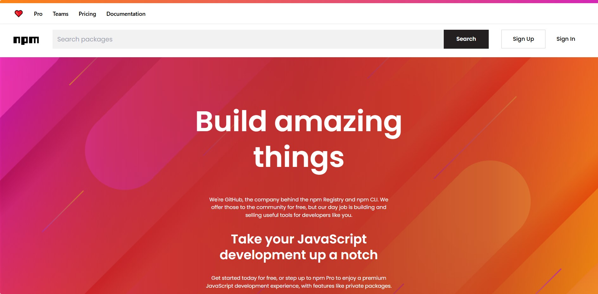

# Npmjs Website Clone
> This project is a clone of the npmjs website. Its a dynamic website that fetches data from the npmjs API and displays it on the website. The website is built using React and Tailwindcss.

  

## Built With
- React
- Tailwindcss
- npmjs API

## Features
- Search for packages
- View package details
- View package dependencies
- Visit package version specific page

## Installation
- Clone the repository
- Run `npm install`
- Run `npm run dev`
